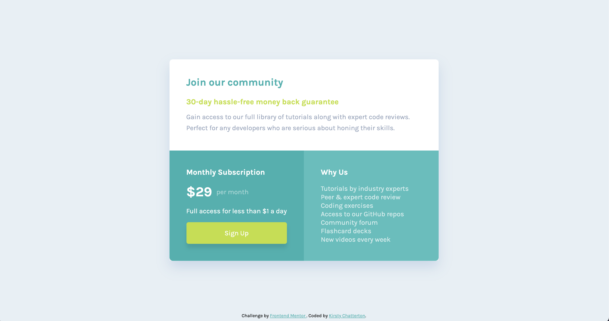

# Frontend Mentor - Single price grid component solution

This is a solution to the [Single price grid component challenge on Frontend Mentor](https://www.frontendmentor.io/challenges/single-price-grid-component-5ce41129d0ff452fec5abbbc). Frontend Mentor challenges help you improve your coding skills by building realistic projects.

## Table of contents

- [The challenge](#the-challenge)
  - [Screenshot](#screenshot)
  - [Links](#links)
- [Built with](#built-with)
- [Author](#author)

## The challenge

Users should be able to:

- View the optimal layout for the component depending on their device's screen size
- See a hover state on desktop for the Sign Up call-to-action

### Screenshot

### Links

- Solution URL: [https://www.frontendmentor.io/solutions/grid-component-solution-K5TMOaI4X](https://www.frontendmentor.io/solutions/grid-component-solution-K5TMOaI4X)
- Live Site URL: [https://kirstchat.github.io/single-price-grid-component/](https://kirstchat.github.io/single-price-grid-component/)

## Built with

- Semantic HTML5 markup
- CSS custom properties
- Flexbox
- CSS Grid

## Author

- Frontend Mentor - [@KirstChat](https://www.frontendmentor.io/profile/KirstChat)
- LinkedIn - [Kirsty Chatterton](https://www.linkedin.com/in/kirsty-c-154781a4/)
